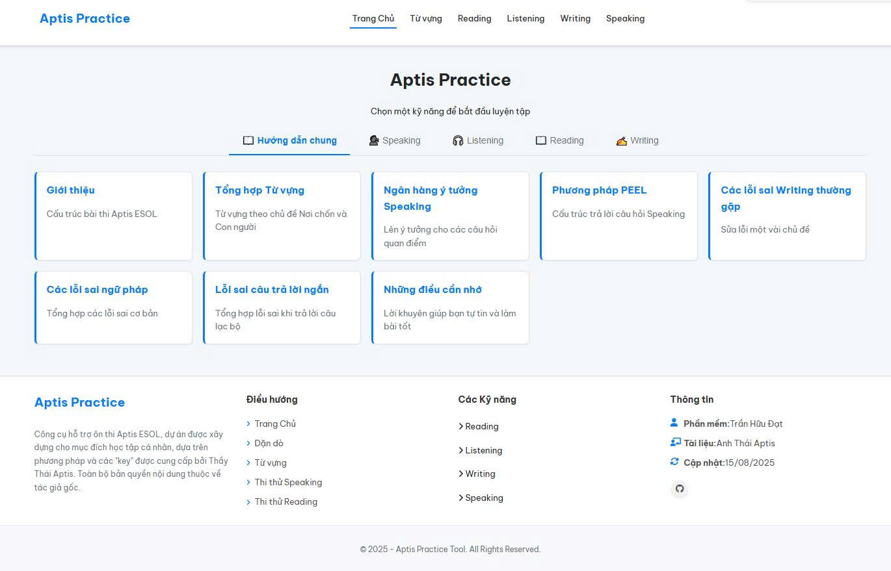

# Aptis Practice Tool - Công cụ Luyện thi Aptis Story-based

 
  
  

  

Đây là một công cụ web được xây dựng để hỗ trợ việc ôn thi Aptis ESOL, đặc biệt là theo phương pháp học "key" và "câu chuyện gợi nhớ" của Thầy Thái Aptis. Dự án này được phát triển từ nhu cầu cá nhân nhằm hệ thống hóa tài liệu và tạo ra một môi trường luyện tập tương tác, hiệu quả.

**👉 Truy cập công cụ tại: [https://tranhuudat2004.github.io/aptis-practice/](https://tranhuudat2004.github.io/aptis-practice/)** <!-- Thay link này bằng link GitHub Pages của bạn -->

---

## 👉 Cấu trúc Dự án 

[kỹ năng].html (ví dụ: reading.html, listening.html): Đây sẽ là trang Tổng quan (Overview), giải thích cấu trúc và yêu cầu của toàn bộ kỹ năng đó.

[kỹ năng]_part[số].html (ví dụ: reading_part1.html, speaking_part2.html): Đây là các trang Luyện tập (Practice) cụ thể cho từng phần.

---

## ✨ Các tính năng chính

Công cụ này được chia thành các module tương ứng với các kỹ năng trong bài thi Aptis:

### 📖 Reading (Đọc)
- **Part 1 (Word Matching):** Luyện tập học thuộc lòng các bộ "key" đáp án thông qua giao diện Flashcard tiện lợi.
- **Part 2 & 3 (Sentence Jumble):** Luyện tập sắp xếp câu thành đoạn văn hoàn chỉnh với chức năng kéo-thả (drag-and-drop) và kiểm tra đáp án tức thì.
- **Part 4 (Opinion Matching):** Luyện tập nối ý kiến của 4 người với 7 nhận định cho sẵn.
- **Part 5 (Matching Headings):** Luyện tập sắp xếp 7 tiêu đề đúng theo thứ tự của bài đọc.
- **Câu chuyện gợi nhớ:** Mỗi bài tập đều đi kèm câu chuyện "bịa" hoặc "logic" để giúp ghi nhớ đáp án một cách hiệu quả.

### 🎧 Listening (Nghe)
- **Part 1 (Câu 1-13):** Luyện tập ghi nhớ hơn 200 đáp án thông qua giao diện phân trang, giúp ôn tập có hệ thống.
- **Part 2 (Câu 14 & 15):** Các bài tập nối thông tin và xác định quan điểm, có tích hợp audio, transcript và công tắc "đảo ngược key" thông minh.
- **Part 3 (Câu 16 & 17):** Luyện tập ghi nhớ các cặp đáp án đúng.
- **Bảng tổng hợp Key:** Hệ thống hóa các đáp án dễ nhầm lẫn (thời gian, giá tiền, màu sắc...) vào một trang duy nhất để dễ dàng tra cứu.

### ✍️ Writing (Viết)
- **Part 1, 2, 3, 4:** Các trang luyện tập riêng biệt cho từng phần.
- **Đồng hồ bấm giờ:** Mô phỏng chính xác áp lực thời gian của phòng thi.
- **Bộ đếm từ:** Tự động đếm và cảnh báo khi vượt quá giới hạn từ cho phép.
- **Tự động lưu bài:** Nội dung bạn viết được tự động lưu vào `localStorage` của trình duyệt, không lo mất bài khi tải lại trang.
- **Ngân hàng câu hỏi & Cẩm nang:** Cung cấp các câu trả lời mẫu và chiến lược làm bài chi tiết.

### 🗣️ Speaking (Nói)
- **Part 1, 2, 3, 4:** Các trang luyện tập mô phỏng từng phần thi.
- **Đồng hồ bấm giờ:** Tích hợp đồng hồ đếm ngược cho cả thời gian chuẩn bị và thời gian trả lời.
- **Audio & Transcript mẫu:** Nghe câu trả lời mẫu và đọc lại transcript để học hỏi.
- **Ngân hàng ý tưởng:** Cung cấp các mẫu câu và ý tưởng để giải thích quan điểm.

<!-- ### ⚙️ Text-to-Speech Generator
- Một ứng dụng web nhỏ chạy trên máy tính (sử dụng Python & Flask) giúp tự tạo file audio mẫu từ văn bản, phục vụ việc mở rộng tài liệu học tập. -->

---

## 🛠️ Công nghệ sử dụng

- **Frontend:** HTML5, CSS3, JavaScript (ES6)
- **Styling:** Giao diện được thiết kế theo hướng "light theme", chuyên nghiệp và responsive.
- **Libraries:** [SortableJS](https://github.com/SortableJS/Sortable) cho chức năng kéo-thả.
- **Text-to-Speech Generator:** (https://github.com/TranHuuDat2004/tts-flask-app)

---

## 🚀 Cách sử dụng

1.  **Sử dụng Online:** Truy cập trực tiếp vào link GitHub Pages ở trên.
2.  **Chạy trên máy tính (Offline):**
    - Clone repository này về máy: `git clone https://github.com/TranHuuDat2004/aptis-practice.git`
    - Mở file `index.html` trong trình duyệt của bạn.

---

## 📝 Giấy phép

Dự án này được cấp phép theo [Giấy phép Quốc tế Creative Commons Ghi công-Phi thương mại 4.0](https://creativecommons.org/licenses/by-nc/4.0/).
Bạn được tự do Chia sẻ và Phỏng theo tài liệu, theo các điều khoản Ghi công và Phi thương mại.

---

## 🤝 Đóng Góp

Dự án này được xây dựng cho mục đích học tập và rất hoan nghênh các ý kiến đóng góp để hoàn thiện hơn. Nếu bạn có ý tưởng hoặc phát hiện lỗi, vui lòng tạo một "Issue" trên repository này.

---

## 🙏 Lời cảm ơn

Xin gửi lời cảm ơn chân thành đến **Thầy Thái Aptis** đã cung cấp phương pháp học và bộ tài liệu ôn thi vô giá. Công cụ này sẽ không thể hoàn thành nếu không có những kiến thức đó.

Dự án được phát triển bởi **Trần Hữu Đạt**.